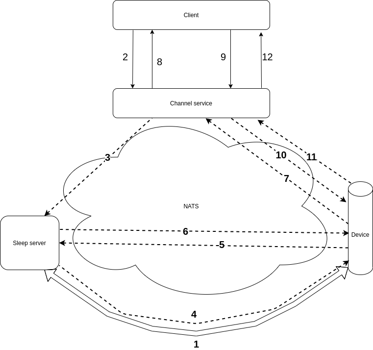

# Device Channel

Proof of concept for CC v2

1. Device establishes TCP (sleeping) connection with the Sleep server and starts sending beacons (data bits). 
   In a separate co-routine, Sleep server subscribes to NATS device subject, on which it will receive the device command, on Device's behalf.
2. HTTP Client (mobile, or other service) sends request to the Channel service to initiate Siren on a device.
3. Channel service sends the Siren request to NATS. NATS forwards the request to the Sleep server (the one that is already subscribed to the device NATS subject).
4. Sleep server receives the Siren request, sends wake up signal through the TCP connection to the device. 
   The sleep server subscribes to Sleep-deviceID NATS subject on which it will receive a signal from the device that is awake.
5. The device wakes up, TCP (sleeping) connection is closed. The devices subscribes to device command channel and sends a awake signal to the Sleep server through the NATS sleep-deviceID subject.
6. Sleep server receives the awake signal from the device and forwards the Siren command to the Device.
7. The Device receives the Siren command, starts sounding the siren and replays back to the Channel service on the Device command NATS subject.
8. Channel service receives the replay of the Siren NATS request and responds back to Client.
9. Client sends Siren OFF request to Channel service.
10. Channel service send Siren OFF request to the Device through the NATS device command subject.
11. The device in this case is already ONLINE and it's not sleeping. The device is already subsribed to its own device command NATS subject.
    The device recieves the Siren OFF requests, it stopping the Siren sound and replay back to Channel service through NATS.
12. Channel service receives the replay and responds to the Client.

## Requirements

- docker
- docker-compose

## Install and Run

Watch the containers logs in each step.

1. Create NATS server, device-channel and sleep-server:

    docker-compose up nats channel sleep

2. Put one device (e.g. ID: 555) on sleeping:

    docker-compose run device ./bin 555

3. Send a Siren command to device (id 555) command channel. Make GET request in a web browser:

    http://localhost:8005/command/555/siren

4. Send another Siren command:

    http://localhost:8005/command/555/siren
